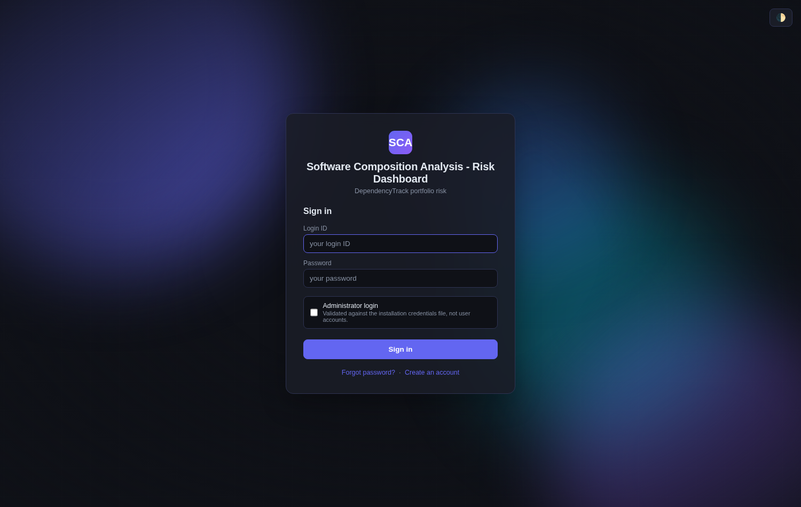

# Dependency-Track — Risk Dashboard

A **portfolio-level risk dashboard** for [DependencyTrack](https://dependencytrack.org/) that displays hierarchical project security and policy violation data in a single filterable view.

> **This project is a dashboard only.** It connects to an existing DependencyTrack instance — it does not include or install DependencyTrack itself.

---

## Quick Start

```bash
git clone <repo-url> dependency-tracker
cd dependency-tracker
chmod +x install.sh
./install.sh
```

The installer starts the dashboard at **http://localhost:3000** and prints the
administrator credentials it created.

> It does **not** ask for a DependencyTrack URL or API key. Those belong to each
> account, not to the installation: sign in, open **⚙ Settings**, and enter
> yours. The key is stored AES-256-GCM encrypted and never reaches a browser.

---

## What it looks like

> Every screenshot on this page is generated from the **stubbed** DependencyTrack
> fixture the end-to-end tests use — `Group 1`, `service-101`, `carrier-for-…`.
> No image contains a real project, a real finding or anybody's data. Regenerate
> them with `node docs/screenshots.js` (see [Screenshots](#screenshots)).
>
> **New here?** [`docs/USER_GUIDE.md`](docs/USER_GUIDE.md) walks the whole
> product step by step, from registering an account to a report arriving by
> email every Monday.


A group row shows the **total of the children its collection logic counts**, and
that logic is the one you set in DependencyTrack. `Collection 4` above aggregates
*direct children marked as latest*, so it shows `service-402`'s **3** — not
3 + 5. A parent that aggregates all its children shows their sum instead, and the
roll-up climbs through however many levels the branch has. The cards are summed
from the same root rows, so a card can never contradict the row under it, and the
risk-trend panel applies the identical rule server-side.

Note that a card folds all four categories together: *Critical issues* is
severity-critical **plus** every operational, licence and security-policy `FAIL`,
which is why it is larger than the Critical column alone.


The findings dialog answers the question a release engineer actually has: is this
component **Direct** (it blocks the release) or **Transitive** (it goes on the
security SME's backlog)? Turning on *Show full dependency paths* resolves the
chain behind each transitive finding — `carrier-for-service-201 →
dep-service-201-2` — and says when there is more than one way in.

<details>
<summary>More screens — risk trend, settings, administration, sign-in</summary>

| | |
|---|---|
|  | **Risk trend.** Critical/high/medium/low over the last week, month or year. A day nobody refreshed carries the previous reading, drawn dashed and shaded so it cannot be mistaken for a measurement. |
|  | **Settings.** Your own DependencyTrack connection, mail, and schedules. The API key is write-only — it is never returned to a browser. |
|  | **Administration.** Accounts, quotas, storage headroom and branding. It can do exactly eleven things and read nothing sensitive. |
|  | **Sign-in.** Registration and sign-in, with the administrator-configurable title and background. |

</details>

---

## What's Included

| Component | Description |
|-----------|-------------|
| `dashboard/login.html` | Sign-in and registration page (zero npm dependencies) |
| `dashboard/index.html` | Single-file SPA dashboard (zero npm dependencies) |
| `dashboard/admin.html` | Single-file administration screen (administrator only) |
| `dashboard/nginx.conf.template` | nginx config: serves the three pages and proxies `/auth/`, `/admin/`, `/profile`, `/branding`, `/healthz` and `/violation-cache/` to the backend |
| `violation-cache/server.js` | Node.js service that pre-fetches policy violations server-side |
| `violation-cache/Dockerfile` | Builds the cache service image |
| `docker-compose.yml` | Defines `dt-dashboard` (nginx), `dt-violation-cache` and `dt-postgres` |
| `install.sh` | Interactive installer |
| `.env.example` | Environment variable reference |

---

## What it does

- **A hierarchical portfolio view** of every project's security, licence and
  operational risk, filterable and searchable, built from a violation cache that
  accounts sharing a DependencyTrack connection build once between them.
- **A risk trend over time**, above the summary cards: critical, high, medium
  and low across the last week, month or year, as a stacked area, lines, or four
  small multiples. A point is recorded each time violation data is refetched, so
  the history builds up day by day. A day with no refresh carries the previous
  reading so the trend stays continuous, drawn dashed and shaded with no data
  marker — so it reads as one line without any carried number being mistakable
  for a measurement.
- **Excel reports on demand**, with security findings, a CWE summary, and
  licence and operational policy violations — each finding and licence violation
  marked **Direct** or **Transitive**, with the dependency path behind a
  transitive one, the same question the findings dialog answers on screen.
- **Scheduled reports by email.** Each account can have several — a weekly
  operational report to one team and a monthly licence report to another — each
  with its own projects, frequency, time, risk categories and recipients. Times
  are picked in **your own browser's timezone**, so the container's clock is
  irrelevant.
- **Multi-user from the ground up.** Every account has its own DependencyTrack
  connection, settings, mail configuration, schedules and reports. No account can
  see another's anything.
- **An administration screen** for account overview, quotas and branding.

---

## Docker Stack

| Container | Image | Purpose |
|-----------|-------|---------|
| `dt-dashboard` | `nginx:alpine` | Serves the dashboard, login and administration pages; proxies `/auth/*`, `/profile`, `/admin/*`, `/branding` and `/violation-cache/*` to the backend |
| `dt-violation-cache` | Built locally | Authentication, per-user configuration, reports, scheduler, shared violation cache |
| `dt-postgres` | `postgres:16-alpine` | System of record for users, settings, schedules and reports |

> `dt-violation-cache` will not start until `dt-postgres` is healthy — schema
> migrations run before it accepts requests. The database is published on
> `POSTGRES_PORT` so you can attach pgAdmin or DBeaver from outside Docker.

---

## Installer Options

```bash
./install.sh [OPTIONS]
```

| Flag | Description |
|------|-------------|
| _(none)_ | Interactive install — prompts for all settings |
| `--non-interactive` | Skip prompts, use `.env` values / defaults |
| `--skip-docker-check` | Skip Docker version validation |
| `--uninstall` / `-u` | Remove containers and the network. **Keeps all data**, images and `.env` |
| `--all` / `-a` | Remove containers, network and images, **and delete the database**. Asks you to type `DELETE` |
| `--help` | Show usage |

---

## Configuration

Copy `.env.example` to `.env` and set:

> **DependencyTrack is configured per user, not here.** Sign in, open ⚙ Settings, and
> enter your DependencyTrack URL and API key. The key is stored AES-256-GCM encrypted
> and never leaves the server — the backend proxies DependencyTrack calls on your
> behalf. The `DT_*` variables below exist only to migrate an installation that ran
> the earlier single-tenant build.

| Variable | Description |
|----------|-------------|
| `DT_DASHBOARD_PORT` | Host port for the dashboard (default `3000`) |
| `SECRET_ENCRYPTION_KEY` | **Required.** AES-256-GCM key for stored API keys and SMTP passwords — generated by `install.sh`. Back it up |
| `SCA_ADMIN_USER` / `SCA_ADMIN_PASSWORD` | Administrator credentials, read by `install.sh` only |
| `DT_API_INTERNAL_URL`, `DT_API_KEY`, `DT_FRONTEND_URL` | Upgrade only: seeded onto existing accounts once at first boot, then ignored |
| `VIOLATION_CACHE_TTL_HOURS` | Hours before violation cache auto-expires (default `24`) |
| `VIOLATION_JOB_STALL_MINUTES` | Silence after which a refetch is presumed wedged (default `15`). Not a cap on total run time |
| `SCHEDULER_CONCURRENCY` | Scheduled reports building at once, across all accounts (default `5`). One account's own schedules always run one at a time regardless |
| `REPORT_CONCURRENCY` | Parallel project fetches inside one report (default `5`) |
| `VIOLATION_CONCURRENCY` | Parallel violation fetches during a cache build (default `3`) |
| `SNAPSHOT_RETENTION_DAYS` | Days of daily risk history kept for the trend graph (default `400`) |
| `POSTGRES_USER` | Database role (default `dtdash`) |
| `POSTGRES_PASSWORD` | Database password — generated by `install.sh` when absent |
| `POSTGRES_DB` | Database name (default `dtdash`) |
| `POSTGRES_PORT` | Host port the database is published on (default `5432`) |
| `SESSION_ABSOLUTE_HOURS` | Absolute session lifetime (default `8`) |
| `SESSION_IDLE_HOURS` | Idle session lifetime (default `2`) |
| `LOG_FORMAT` | `text` (default) or `json` |

> All three concurrency limits and `LOG_FORMAT` are forwarded into the container
> by `docker-compose.yml`. They were documented here before they were, so setting
> them used to do nothing.

---

## Tech Stack

- **Dashboard**: HTML5, CSS3, Vanilla JS (ES2020+), Fetch API — no framework, no build step
- **Backend**: Node.js 22, built-in `http`/`https` (no web framework). Three npm
  dependencies, all MIT: `pg`, `exceljs`, `nodemailer`
- **Passwords**: minimum 12 characters, maximum 128, no spaces, no complexity
  rule — length beats character classes, per current NIST and OWASP guidance
- **Auth and crypto**: Node's built-in `crypto` only — scrypt password hashing,
  random bearer tokens, AES-256-GCM secret encryption. No auth library, no JWT
- **Database**: PostgreSQL 16 (PostgreSQL Licence), parameterised SQL, no ORM
- **Infrastructure**: nginx:alpine, postgres:16-alpine, Docker Compose

---

## Docs

- [Installation Guide](docs/INSTALLATION.md)
- [Dashboard Integration Guide](docs/DASHBOARD_INTEGRATION.md)
- [Performance validation](docs/PERFORMANCE.md) — query plans and load evidence

## Administration

The administrator signs in with the credentials `install.sh` created and gets a
screen of their own at `/admin.html`: the account list with each account's
limits, a detail pane, the service-wide defaults, storage headroom for the
volume the database sits on, and the sign-in branding.

Beyond reading it can do exactly eleven things — set the default report and
schedule limits, set one account's limits, reset one account's password, change
the application title, upload or remove the sign-in background, upload or remove
the application icon, show or hide the risk-trend panel, and upload or remove a
colour theme. Everything else about an account is readable only: **no
administrator route can read anybody's DependencyTrack key, SMTP password or
report contents.**

That list is a contract, not a summary. A test asserts those eleven method/path
pairs are handled and that every other write is not, so adding a twelfth means
editing the allow-list in a diff somebody reads (CLAUDE.md §7.6).

## Continuous integration

`.github/workflows/ci.yml` runs on every pull request and on every push to
`main`, as four jobs:

| Job | What it runs |
|---|---|
| **offline** | Unit, route, frontend-contract and installer tests — no database, no Docker, no network. Keeping it separate is what proves that tier really is offline. |
| **database** | The opt-in `db.test.js` tier against a real `postgres:16-alpine` service container — migrations, partial indexes, cascade deletes, `SKIP LOCKED`. |
| **e2e** | The assembled product: the real `server.js`, a real database and the real pages in Chromium, with only DependencyTrack and SMTP stubbed. The one job that notices a change correct in every unit and wrong once the layers are joined up. |
| **audit** | `npm ls` and `npm audit`, recorded rather than enforced — see CLAUDE.md §10.3 for why it deliberately does not gate merges. |

See CLAUDE.md §10.3 for what each job is for and what CI deliberately does not do.

## Running the tests yourself

```bash
node --test violation-cache/server.test.js violation-cache/dashboard.test.js \
             violation-cache/installer.test.js          # offline: no database, no network

# Opt-in tiers. Both DESTROY the contents of the database you point them at.
TEST_DATABASE_URL=postgres://… node --test violation-cache/db.test.js
TEST_DATABASE_URL=postgres://… node --test violation-cache/e2e.test.js
```

Run the two opt-in tiers **separately**, not in one `node --test` invocation:
the end-to-end tier resets the schema out from under anything sharing it. The
end-to-end tier's browser section skips by itself unless Playwright resolves —
it is a CI tool, not a project dependency, so the three-package cap in CLAUDE.md
§3 still holds.

## Screenshots

The images in this README and in [`docs/USER_GUIDE.md`](docs/USER_GUIDE.md) are
regenerated by:

```bash
TEST_DATABASE_URL=postgres://… node docs/screenshots.js
```

It boots the same stubbed stack the end-to-end tier uses and drives it with
Playwright, so the portfolio, findings and dependency graph in every image are
synthetic fixtures. Nothing from a live DependencyTrack can reach a committed
PNG. Like `docs/perf-check.js` it is a tool rather than a test tier — nothing
runs it automatically.

It runs as **one continuous journey**, in the same order the user guide tells
it: register, sign in with nothing configured, add a connection, then report and
schedule. That ordering is not cosmetic — the first-run screen showing demo data
only exists before a connection is saved, so shooting the finished product and
reconstructing the earlier screens afterwards would mean faking it.

## Documentation

| Document | For |
|---|---|
| [`docs/USER_GUIDE.md`](docs/USER_GUIDE.md) | Using the dashboard, step by step, with a screenshot per screen. |
| [`docs/THEME_TOKENS.md`](docs/THEME_TOKENS.md) | Every colour theme property, mapped to the part of the product it paints, with before/after screenshots. |
| [`docs/DASHBOARD_INTEGRATION.md`](docs/DASHBOARD_INTEGRATION.md) | Embedding the dashboard elsewhere, and how its numbers are derived. |
| [`docs/PERFORMANCE.md`](docs/PERFORMANCE.md) | Query plans and load evidence. |
| [`CLAUDE.md`](CLAUDE.md) | Architecture, conventions and the reasoning behind them — for contributors. |
