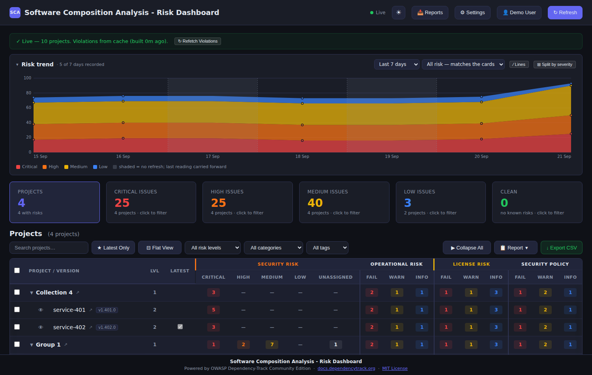
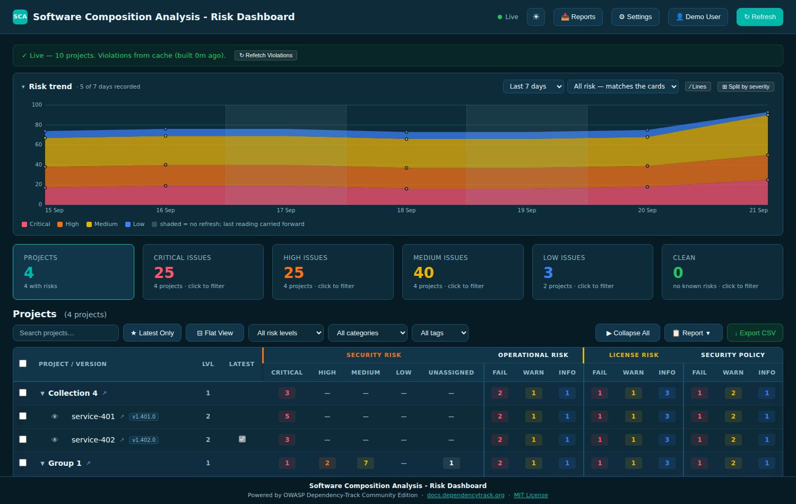
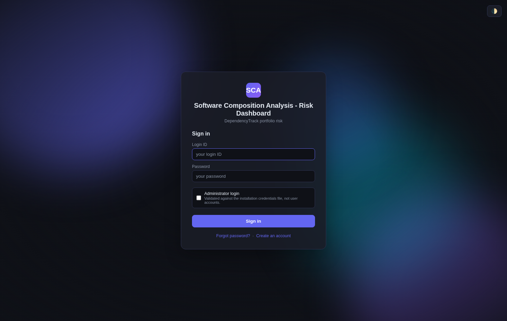
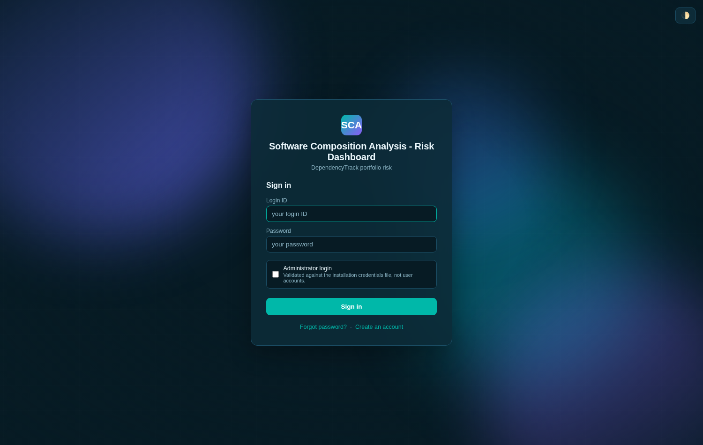

# Colour theme — token reference

This is the map from a theme file's property names to the part of the product
each one actually paints. **[`docs/USER_GUIDE.md`](USER_GUIDE.md#10–11-the-colour-theme)**
covers *how* to upload a theme; this document covers *what each colour does*
once it is applied — the question a table of hex codes alone cannot answer.

> The screenshots below come from `docs/screenshots.js` against the stubbed
> DependencyTrack, the same as every other image in this repository (see
> [Screenshots](../README.md#screenshots)). The theme applied for the "after"
> shots is a demo palette named **"Ocean"**, defined in the tool itself —
> nothing here reflects a real installation.

---

## Before and after, side by side

The demo theme is **deliberately partial** — it sets nine properties out of
forty and leaves the rest untouched. That is not a limitation of the example;
it is the point. [§10–11 of the user guide](USER_GUIDE.md#10–11-the-colour-theme)
explains why partial files are the normal way to use this feature: everything
the file does not mention keeps the colour the product ships with, one
property at a time, with no "all or nothing" upload to get right.

Both columns are the same viewer, the same dark/light choice and the same
stub data — only the theme upload differs — so the comparison isolates what
the theme actually changed rather than mixing in an unrelated dark/light
difference.

| Built-in colours | With the "Ocean" theme applied |
|---|---|
|  |  |
|  |  |

Look for what did **not** change: the severity pills (`High`, `Medium`,
`Low`), the Operational/License/Security-policy column headings, and the
sign-in page's decorative shapes are all still their built-in colours in the
"after" images, because the demo theme's `dark` block never mentions
`high`, `medium`, `low`, `cat-operations`, `cat-secpolicy` or any
`login-blob-*` property. What *did* change — the page background, the cards,
the borders, the accent colour on every button and toggle, and `Critical` —
did so because those nine keys are exactly what the file set. The sign-in
page changed too, for a visitor who has never signed in, because the theme is
public (§12 of `CLAUDE.md`) for the same reason the application title and the
sign-in background already are.

The file behind the "after" column, in full:

```json
{
  "version": 1,
  "name": "Ocean (doc demo)",
  "dark": {
    "bg": "#071b24", "surface": "#0d2b38", "surface2": "#113649",
    "border": "#1c5068", "text": "#eaf6fb", "text-muted": "#8fb9c9",
    "accent": "#00b8a9", "accent-hover": "#00a396", "critical": "#ff5470"
  },
  "light": {
    "bg": "#eefbf9", "surface": "#ffffff", "accent": "#00897b"
  }
}
```

---

## The full token map

Every property a theme file may set, grouped by what it actually paints. This
is the same set `lib/theme.js` accepts and `GET /admin/theme`'s `template`
field hands you pre-filled — the property names here are exactly what goes in
the JSON, without the leading `--`.

### Surfaces and text — the base of every screen

These six set the page's own colours and are what most of a theme touches.
They are also what almost never needs to move on their own: a theme that only
changes `accent` and leaves these at the built-in values (like the demo
above) still reads as "this installation's colour," because the base stays
legible underneath it.

| Property | What it paints |
|---|---|
| `bg` | The page background, behind everything else. |
| `surface` | Cards, panels, modals, the table's own background — the "first layer" above `bg`. |
| `surface2` | A second layer inside a surface: the hover state on a table row, a filled progress track, a disabled control's background. |
| `border` | Every 1px divider, card outline and input border. |
| `text` | Primary text — headings, table cells, button labels. |
| `text-muted` | Secondary text — hints, timestamps, placeholder text, the "×5" in a KPI card's subtitle. |

### Accent — the one colour that marks something as *actionable*

| Property | What it paints |
|---|---|
| `accent` | Primary buttons, links, the active state of a tab or toggle, checked checkboxes, the header logo mark's near gradient stop, the selected weekday in the schedule picker, a selected row in Administration's account table. |
| `accent-hover` | The primary-button hover state (`.btn.primary:hover`), swapped in from a hard-coded `#4f46e5` when this feature shipped — it used to be un-themeable. |
| `on-accent` | Text and icon colour drawn **on top of** an accent-filled surface — the header logo mark's initials, a primary button's label, a toggle switch's knob, the "N" badge on the multi-select filter button, a selected admin row's text. White in the built-in palette, in both schemes; the token exists so a theme with a *pale* accent (yellow, cream) can set this to something dark and stay readable, which `#fff` hard-coded into the page could never do. |

### Severity — the risk vocabulary of the dashboard itself

Each severity has a solid colour (the pill text and border) and a paler `-bg`
tint (the pill's fill, and the KPI card backgrounds). `critical` and
`critical-bg` are also what the **security** column-group heading is *not* —
see the next section for why that heading is actually `high`-coloured.

| Property | What it paints |
|---|---|
| `critical` / `critical-bg` | Critical-severity pills, the "Critical Issues" KPI card, the `Critical` line on the risk-trend chart, danger buttons' *fill* (their text uses `on-critical`, below). |
| `high` / `high-bg` | High-severity pills and chart line — **and** the **Security Risk** column-group heading and its left border, which was set to `high` rather than `critical` when the table's four-group header was designed. |
| `medium` / `medium-bg` | Medium-severity pills and chart line — **and** the **License Risk** column-group heading. |
| `low` / `low-bg` | Low-severity pills and chart line. |
| `ok` / `ok-bg` | The "no issues" state — a clean severity pill, the connection-test success message. |
| `on-critical` | Text on a `critical`-filled surface: the **Remove**/**Delete**/**Cancel schedule** buttons (`.btn.danger`) and the small red count badge on the 📄 Reports button when a report needs attention. White by default, for the same reason `on-accent` is. |

### Table headers, code and scrollbars — smaller surfaces, easy to miss

| Property | What it paints |
|---|---|
| `cat-operations` | The **Operational Risk** column-group heading and its left border — the table's fourth category is `secpolicy`, below, but this one covers the *third* of the four groups. |
| `cat-secpolicy` | The **Security Policy** column-group heading and its left border. |
| `code` | Monospaced `<code>` text inside a modal — today that is exactly one place: **Administration → Storage**, where the filesystem path is shown as `<code>/data</code>`. The rule is duplicated on all three pages for consistency (§8.8's mirroring pattern), but only `admin.html` currently renders a `<code>` element. |
| `scrollbar` / `scrollbar-hover` | The custom scrollbar thumb (`::-webkit-scrollbar-thumb`) drawn over the table and any other scrolling panel. **Chromium and Edge only** — Firefox and Safari use their own scrollbar styling and ignore this property entirely, which is a browser limitation, not a bug in the theme. |
| `tree-group-bg` | The background tint of a **group row** in the project table (tree and flat view). |
| `tree-counted-bg` | The background tint of a **leaf row the roll-up counts** — a project whose numbers contribute to the group total above it. A little stronger than `tree-group-bg`, on purpose: the two are meant to read as one family. |
| `tree-uncounted-bg` | The background tint of a **leaf row the roll-up does not count** — for example a non-latest sibling under a "latest only" collection root. Grey by default, deliberately a different hue family from the other two: it marks a row as *visible but not part of the number above it*, most often because it only appears while a search, tag or risk filter is active. |

### The sign-in page's decoration

Nine properties exist only for `login.html`, and they never change between
the dark and light scheme — the animated background sits *behind* the
sign-in card, not on a surface a reader looks straight at, so it does not
need to follow the theme toggle the way the card itself does.

| Property | What it paints |
|---|---|
| `login-blob-1` … `login-blob-4` | The four soft shapes behind the ordinary **sign-in** form. |
| `login-blob-admin-1` … `login-blob-admin-4` | The four shapes shown instead when **Administrator login** is ticked — a different palette so the two modes are visually distinguishable at a glance, not only by the checkbox. |
| `logo-gradient-end` | The far stop of the logo mark's gradient (`accent` is the near stop) — visible on the sign-in page's logo square, not the header's flat-accent version. |

---

## What a theme file cannot touch

`--header-h`, `--row-h` and `--radius` are declared in the same `:root` block
as every colour above, but **they are not accepted by a theme file** and
`PUT /admin/theme` refuses them by name if you try. They are measured layout
values — the sticky table header reads `--row-h` to know how tall a row is,
in pixels, for its own positioning maths — so a "theme" that changed them
would silently become a layout change with its own failure modes, which is a
different feature from the one this is.

---

## How this actually reaches the page

Short version, for the curious: the theme is never merged with the built-in
colours in code. Every page already declares its own complete `:root` block;
an uploaded theme is served as a second, small stylesheet
(`/branding/theme.css`) linked *after* it, at equal CSS specificity. A
property the theme sets simply overrides the built-in declaration that came
before it — the ordinary way CSS has always worked — and a property the
theme never mentions is never overridden, so it stays whatever the built-in
block said. That is the entire mechanism, and it is why a nine-property file
can safely leave the other thirty-one alone: there is no step anywhere that
has to know what "the rest" should default to.

The full design rationale — why the file is JSON and not a stylesheet, why a
bad upload is refused whole rather than partly applied, and how the
stylesheet is generated so nothing an operator types can break out of a CSS
declaration — is in [`CLAUDE.md` §8.12](../CLAUDE.md#812-the-administrators-colour-theme-q49).
That section is written for people changing the code; this one is written for
people deciding what colour to put where.
