# User Guide

How to use the Software Composition Analysis Risk Dashboard, from your first
sign-in to a report landing in your inbox every Monday morning.

> **About the screenshots.** Every image here is generated by
> [`docs/screenshots.js`](screenshots.js) against a stubbed DependencyTrack — the
> same one the end-to-end tests use. The projects (`Group 1`, `service-201`), the
> findings and the dependency graph are synthetic fixtures. Nothing in these
> images comes from a real installation, which is also why the numbers on your
> own screen will differ.

**Contents**

1. [Create your account](#1-create-your-account)
2. [Your first sign-in](#2-your-first-sign-in)
3. [Connect to DependencyTrack](#3-connect-to-dependencytrack)
4. [Read the dashboard](#4-read-the-dashboard)
5. [Track risk over time](#5-track-risk-over-time)
6. [Inspect a project's findings](#6-inspect-a-projects-findings)
7. [Generate an Excel report](#7-generate-an-excel-report)
8. [Set up email](#8-set-up-email)
9. [Schedule a recurring report](#9-schedule-a-recurring-report)
10. [Manage your account](#10-manage-your-account)
11. [For administrators](#11-for-administrators)
12. [Troubleshooting](#12-troubleshooting)

---

## 1. Create your account

Open the dashboard URL your administrator gave you. You land on the sign-in
page; choose **Create an account** underneath the form.

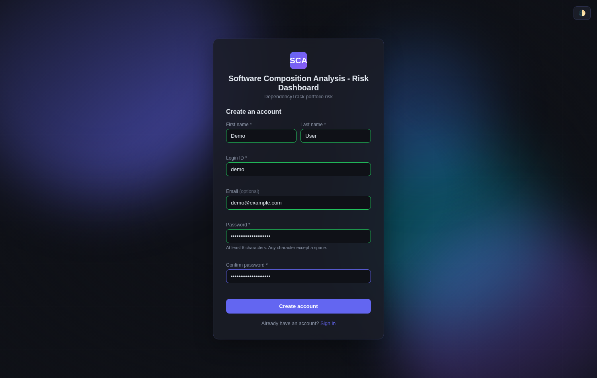

Fill in:

| Field | Notes |
|---|---|
| First name, Last name | Shown in the header and on your profile. |
| Login ID | What you sign in with. Checked for availability as soon as you leave the field. It cannot be changed later. |
| Email address | Optional, but it is how a password reset reaches you. Also unchangeable. |
| Password | **At least 12 characters, no spaces.** There is no upper-case/digit/symbol rule — a long passphrase is both stronger and easier. |

> **You cannot register the administrator's login ID**, nor `root` or `system`.
> Those are reserved so nobody can shadow the installation's administrator.

Select **Create account**. You are returned to the sign-in form with your login
ID already filled in.

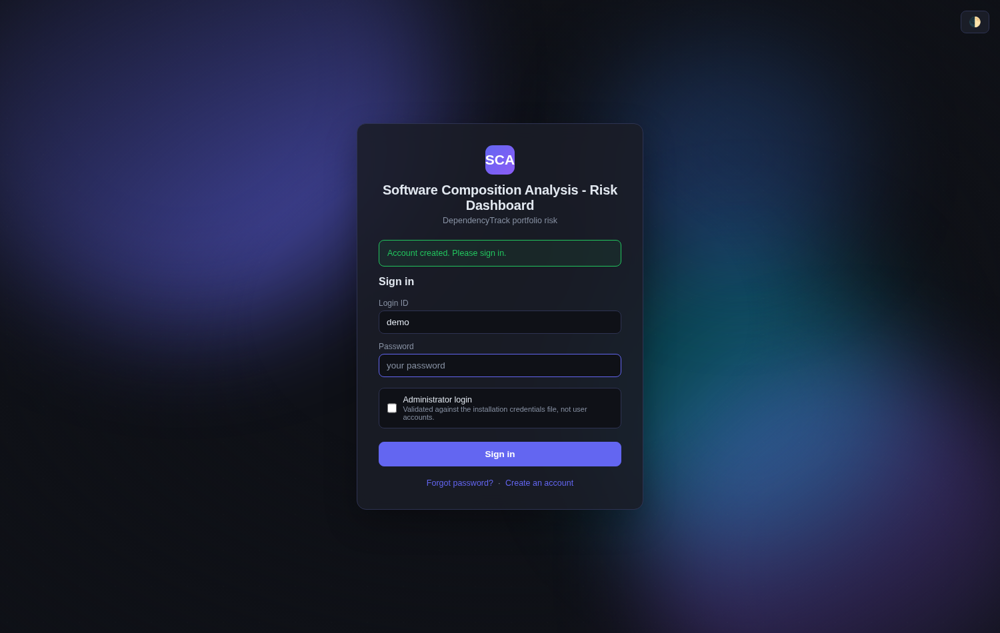

Leave **Administrator login** unticked — that box is for the single installation
administrator, whose credentials live in a file rather than in the account
database.

---

## 2. Your first sign-in

Enter your password and sign in. Because no DependencyTrack connection exists
yet, the dashboard opens in **demo mode**: everything is real software drawing
made-up data, so you can look around before connecting anything.

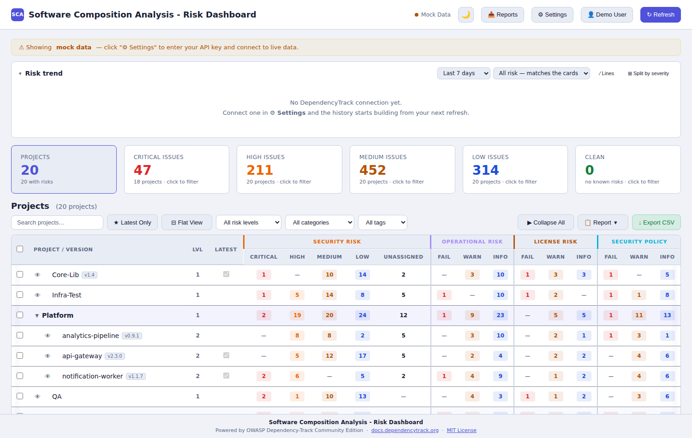

Three things tell you this is not your portfolio:

- the **● Mock Data** indicator in the header (it reads **● Live** once connected),
- the amber banner across the top,
- the risk-trend panel saying *"No DependencyTrack connection yet."*

Nothing you see here is stored and nothing is sent anywhere. Move on to the next
step whenever you are ready.

> **Only one session per account at a time.** If you sign in from a second
> browser you are asked whether to disconnect the first. That is deliberate, and
> it is why signing in from home after leaving a session open at work prompts you
> rather than silently failing.

---

## 3. Connect to DependencyTrack

Select **⚙ Settings** in the header. The first section is **Connection**.

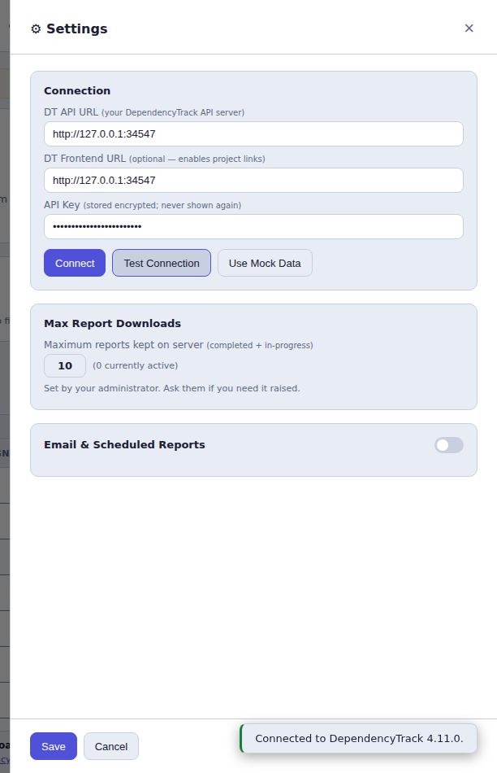

| Field | What to enter |
|---|---|
| **DT API URL** | The base URL of your DependencyTrack **API server**, e.g. `https://dtrack.example.com`. Not the path to an endpoint. |
| **DT Frontend URL** | Optional. The DependencyTrack web UI, so project names in the table become links. Often the same host. |
| **API Key** | A DependencyTrack API key with at least **`VIEW_PORTFOLIO`** permission. |

Select **Test Connection** first. A successful test confirms three things at
once — the URL really is a DependencyTrack API root, the key is accepted, and
the key carries the permission the dashboard needs. On success you see the
server's version, as above.

Then select **Save**.

**Your connection is yours alone.** Each account stores its own URL and key; you
never see another user's, and they never see yours.

> **The API key is stored encrypted and is never sent back to a browser** — not
> to yours, not to anyone's. After saving, the field shows only that a key is
> configured. To change it, type a new one over the top; to keep it, leave the
> field alone.

The dashboard now fetches your portfolio and begins building the **violation
cache** — one pass over DependencyTrack's policy violations, so that every later
page load is instant. The banner reads *"⏳ Refetching violations…"* while it
runs; the policy columns stay at zero until it finishes.

> **Users who share a DependencyTrack connection share one cache build.** If a
> colleague on the same connection started a refresh, your ↻ Refresh button is
> disabled until theirs finishes — you get their result rather than making
> DependencyTrack do the same work twice.

---

## 4. Read the dashboard

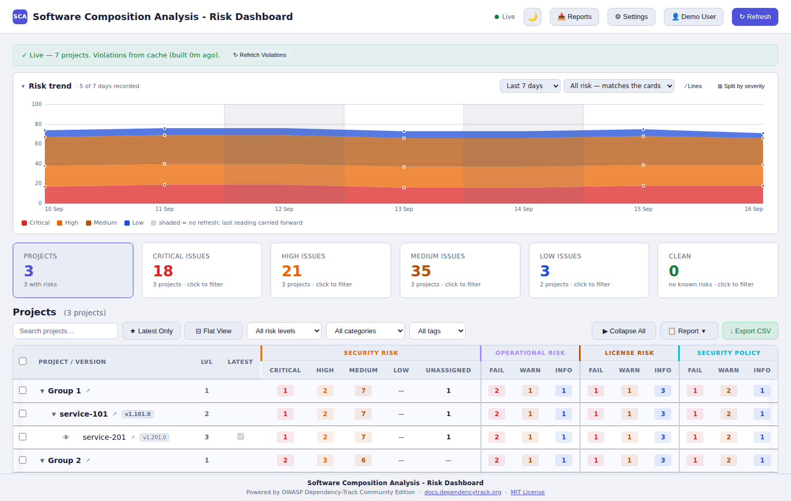

**The table is your project hierarchy.** Group rows (bold, with a ▾) expand to
their children. A **group row's numbers are the total of everything beneath it**
— in the screenshot `Group 1`, `service-101` and `service-201` show identical
figures because that branch is a single chain three levels deep.

**The four column groups are four different questions:**

| Group | What it counts |
|---|---|
| **Security risk** | CVEs, by severity — Critical / High / Medium / Low / Unassigned. |
| **Operational risk** | Policy violations about how a component is maintained (outdated, unresolved). |
| **License risk** | Policy violations about a component's licence. |
| **Security policy** | Policy violations your DependencyTrack security policies define. |

The last three are **Fail / Warn / Info**, which is DependencyTrack's own policy
violation state — not a severity.

**The cards fold all four together.** *Critical issues* is severity-critical
**plus** every operational, licence and security-policy `FAIL`, which is why it
is a larger number than the Critical column alone. Each card is clickable and
filters the table to the projects contributing to it.

**Other controls:**

- **Search** — two characters or more, matches project names.
- **★ Latest Only** — hides older versions of the same project.
- **⊟ Flat View** — drops the hierarchy and lists every project.
- **All risk levels / All categories / All tags** — narrow the table.
- **↓ Export CSV** — the table as it currently stands.
- **↻ Refresh** — reloads the hierarchy *and* refetches violations. Use this
  after adding a project in DependencyTrack; nothing else picks up a new one.

A **⚠** beside a project name means its numbers may be incomplete — hover it for
the reason. On a group row it means a descendant's numbers are missing, so the
group's total may be understated.

---

## 5. Track risk over time

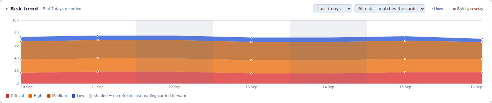

The panel above the cards is server-side history: one reading per day, captured
whenever a violation refresh completes. It is **per connection**, so everyone on
the same DependencyTrack sees the same series.

- **Period** — last 7 days, month or year.
- **Metric** — *All risk — matches the cards* is the default and is the cards'
  own arithmetic. Switch to the severity-only reading if you want pure CVE
  counts.
- **/ Lines** and **⊞ Split by severity** change the drawing.

**A day nobody refreshed carries the previous reading forward**, and the drawing
says so in four ways at once: the bridging line is **dashed**, the span is
**shaded**, a carried day gets **no dot**, and its tooltip names the day the
number actually came from. The header's *"5 of 7 days recorded"* is the only
unqualified statement of how much was really measured.

Days *before* your first reading stay empty. There is nothing to carry.

---

## 6. Inspect a project's findings

Select the **👁** icon beside any leaf project. It appears on projects that have
CVEs **or** licence-policy risk — a project clean on both has no icon, and group
rows never do, because a group has no DependencyTrack project of its own.

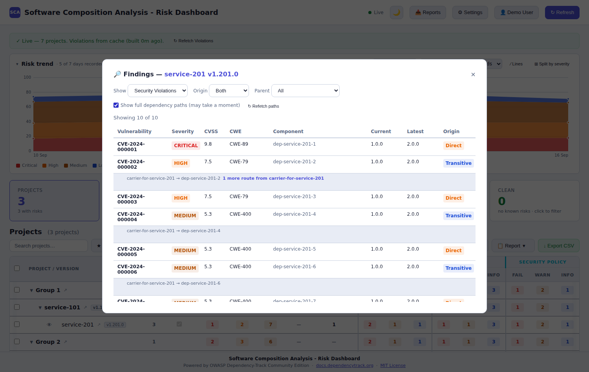

**Show** switches between two independent tables: *Security Violations* (CVEs)
and *License Risk* (licence policy violations).

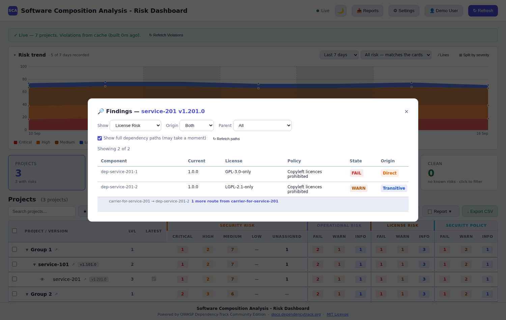

### Origin: the question this dialog exists for

The **Origin** column answers *does this block the release, or does it go on the
backlog?*

| Badge | Meaning |
|---|---|
| **Direct** | Your project declares this component itself. You can change its version. |
| **Transitive** | Something you depend on pulled it in. You cannot bump it directly. |

This badge is always live — it is read from DependencyTrack every time you open
the dialog, so it can never lag behind what DependencyTrack currently reports.

### Dependency paths

**Show full dependency paths** is off by default because it is the expensive
half: it walks the dependency graph outward to work out *how* a transitive
component gets in. Tick it and each transitive finding gains a line beneath it:

```
carrier-for-service-201 → dep-service-201-2   1 more route from carrier-for-service-201
```

Read that as: the direct dependency `carrier-for-service-201` reaches
`dep-service-201-2`, and there is **one further route** in from that same parent
which is not shown. A component reachable from three different direct
dependencies gets three such lines, one per parent.

- A trailing **`+`** (`12+`) means the count is a floor — the walk was cut short,
  so there are *at least* that many.
- **"No path recorded"** means the walk ran and found nothing. That is ordinary:
  a flat, manifest-built SBOM genuinely records no graph.
- The result is **cached and shared** with everyone on your connection, so the
  second person to open this project pays nothing.
- **↻ Refetch paths** re-walks from scratch, for when you suspect the cache and
  DependencyTrack have diverged.

### Narrowing the table

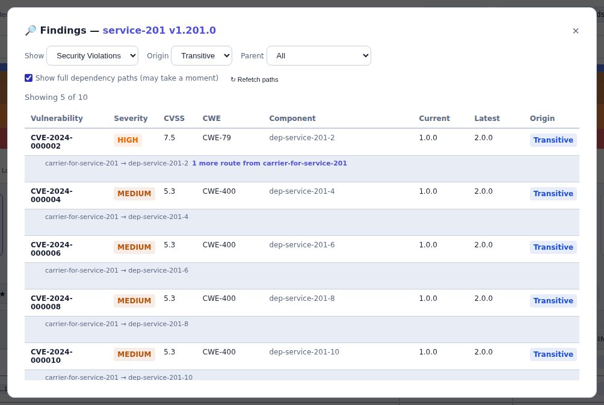

- **Origin** — Both / Direct / Transitive.
- **Parent** — once paths are resolved, filter to the findings reached through
  one particular direct dependency. **All** means no filter; **N/A** means "this
  row *is* a direct dependency".

Both filters are local: changing them makes no network call, and *"Showing N of
M"* updates with them.

> **This dialog does not close if you click beside it** — only the **✕** closes
> it. Opening it starts a crawl against DependencyTrack, and a mis-aimed click
> should not throw that away. Reopening the same project during the same visit
> is instant; it reuses what was already fetched.

---

## 7. Generate an Excel report

Tick the projects you want (leave everything unticked to report on whatever the
table currently shows), then **📋 Report ▾ → Generate Report**.

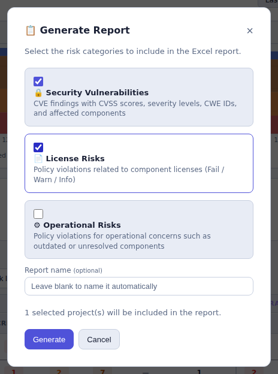

Pick your risk categories. **Report name** is optional — leave it blank and one
is generated with a timestamp.

> A report name is **validated, not silently corrected**. Quotes, slashes and
> control characters are refused, because the name becomes a filename.

The job runs on the server; you can keep working. Open **🗃 Reports** in the
header to see it.

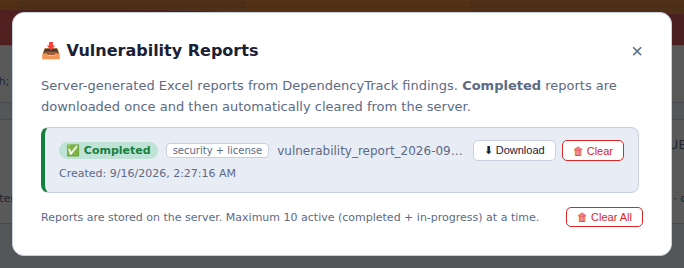

**Download** saves the workbook and clears it from the server. The badge on the
button shows how many are waiting.

### What is in the workbook

One group of sheets per category you ticked — `SV_` security, `LR_` licence,
`OR_` operational:

| Sheet | Contents |
|---|---|
| `SV_Project Summary` | One row per project: its finding counts. |
| `SV_Vulnerability Findings` | Every CVE, with CVSS, CWE and component — **and Origin and Dependency Path**. |
| `SV_Component Summary` | Findings grouped by component. |
| `SV_CWE Summary` | Findings grouped by weakness. |
| `LR_Project Summary` | Licence violations per project. |
| `LR_Violations` | Every licence violation — **also with Origin and Dependency Path**. |
| `LR_Unique Risks` | One row per component, folded across every project. |
| `OR_Project Summary`, `OR_Violations`, `OR_Unique Risks` | The same three for operational policy. |

The operational sheets deliberately carry **no** Origin column: an operational
violation is about how a component is maintained, not about how it entered your
build.

The **Dependency Path** column has four distinct states, and they mean different
things:

| Cell | Meaning |
|---|---|
| *(blank)* | Direct — the Origin column already said so. |
| `a → b → lib` | The chain, one line per parent. |
| `No path recorded` | Walked; the SBOM records no graph for it. |
| `Not resolved` | No walk result — nobody looked. |

On `LR_Unique Risks`, where one row covers several projects, Origin can read
**`Mixed`**: the component is a direct dependency of one project and transitive
in another. Its path cell groups by chain and names the projects each one
belongs to, so *"one project reached through three parents"* can never be
mistaken for *"three projects reached through one each"*.

> **Your report quota** is set by your administrator and shown in Settings.
> Reaching it blocks a new report; it never deletes an old one. Download or
> clear one to make room.

---

## 8. Set up email

Scheduling needs somewhere to send to, so configure email first. In **⚙
Settings**, turn on **Email & Scheduled Reports**.

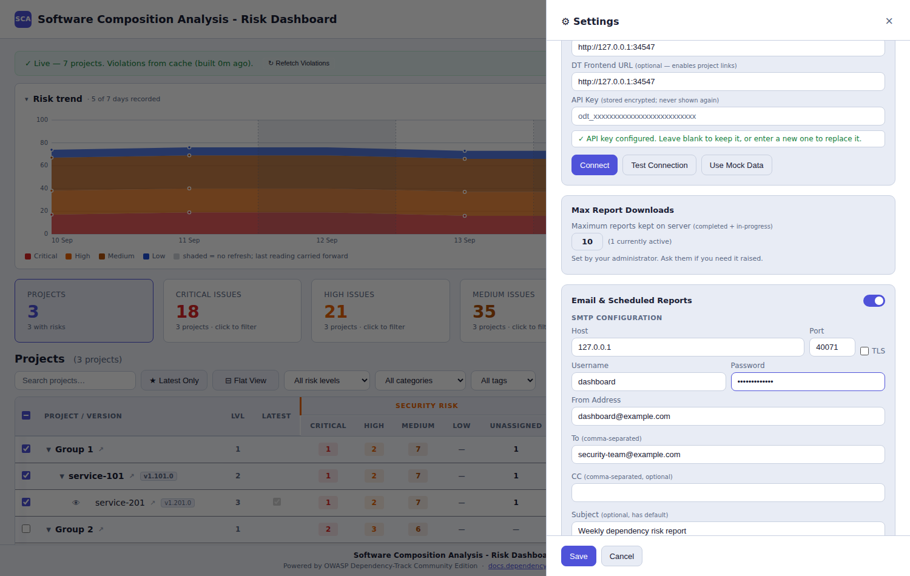

| Field | Notes |
|---|---|
| **Host**, **Port**, **TLS** | Your SMTP server. |
| **Username**, **Password** | SMTP credentials. Stored encrypted; never returned to the browser. |
| **From Address** | What recipients see as the sender. |
| **To** | Default recipients, comma-separated. |
| **CC** | Optional default copy list. |
| **Subject**, **Body** | Defaults for every scheduled report. |

**Send Test Email** proves the settings work before you rely on them. Then
**Save**.

---

## 9. Schedule a recurring report

Tick your projects, then **📋 Report ▾ → Schedule Reports**.

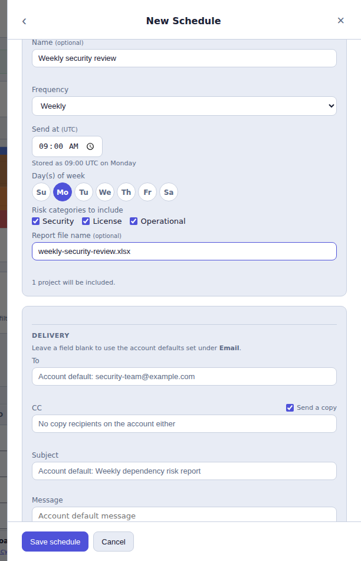

| Field | Notes |
|---|---|
| **Name** | The label in your schedule list. Purely for you. |
| **Frequency** | Daily, Weekly (pick days) or Monthly (pick a day, capped at the 28th so every month has one). |
| **Send at** | Shown in **your** timezone; the caption underneath says what is stored in UTC. |
| **Risk categories** | Same three as a manual report. |
| **Report file name** | What the attached workbook is called. |
| **Delivery** | Leave blank to inherit the account defaults from step 8. |

**CC has three distinct states**, which is why it has its own switch:

- switch **on**, field **blank** → inherit the account's CC list,
- switch **on**, field **filled** → copy exactly these people,
- switch **off** → **copy nobody**.

A blank field alone cannot express "copy nobody", which is why the switch exists.

Select **Save schedule**, then **←** to return to the list.

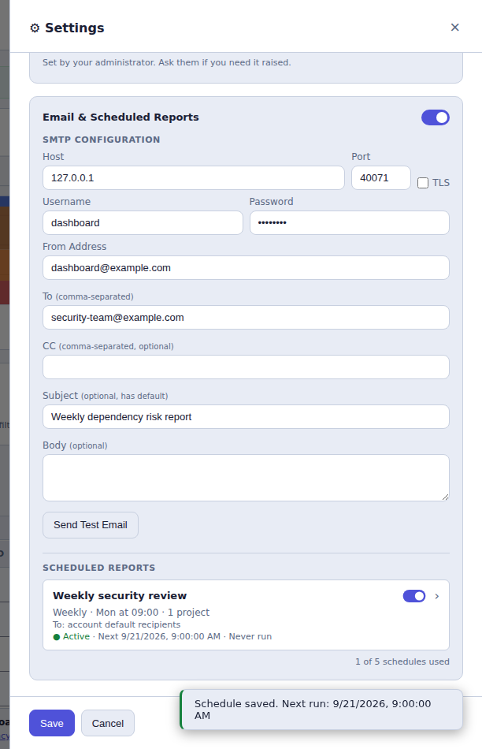

Each row shows the frequency, the next run, the recipients and whether it has
ever run. The row itself gives you two things: the **switch** pauses a schedule
without discarding it, and selecting the row **opens it** for editing.

Everything else lives inside the editor, below the delivery fields:

- **Send now** — runs it immediately **without moving the timetable**. A Monday
  09:00 schedule stays Monday 09:00 however often you test it, and a paused
  schedule can still be sent by hand. It also takes its turn in the queue rather
  than starting a second crawl.
- **Runs** — the run history, kept for 90 days.
- **Cancel this schedule** — deletes it. The record that it ran survives.

> **You can have several schedules, but only one of yours runs at a time.** Five
> due at 09:00 run one after another rather than opening five simultaneous
> crawls against your single DependencyTrack connection.

Scheduled reports are built in memory and emailed. They never appear in your
Reports list and are never written to disk.

---

## 10. Manage your account

**👤 → Profile**.

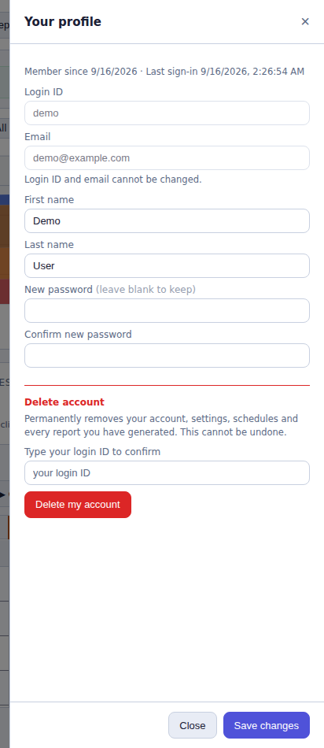

You can change your **first and last name** and your **password**. Login ID and
email address are fixed at registration.

**Delete account** removes your account, settings, schedules and every report you
have generated. You must type your login ID to confirm. The authentication audit
trail survives, as an audit trail must.

---

## 11. For administrators

Sign in with **Administrator login** ticked, using the credentials from
installation. Then **👤 → 🛡 Administration**.

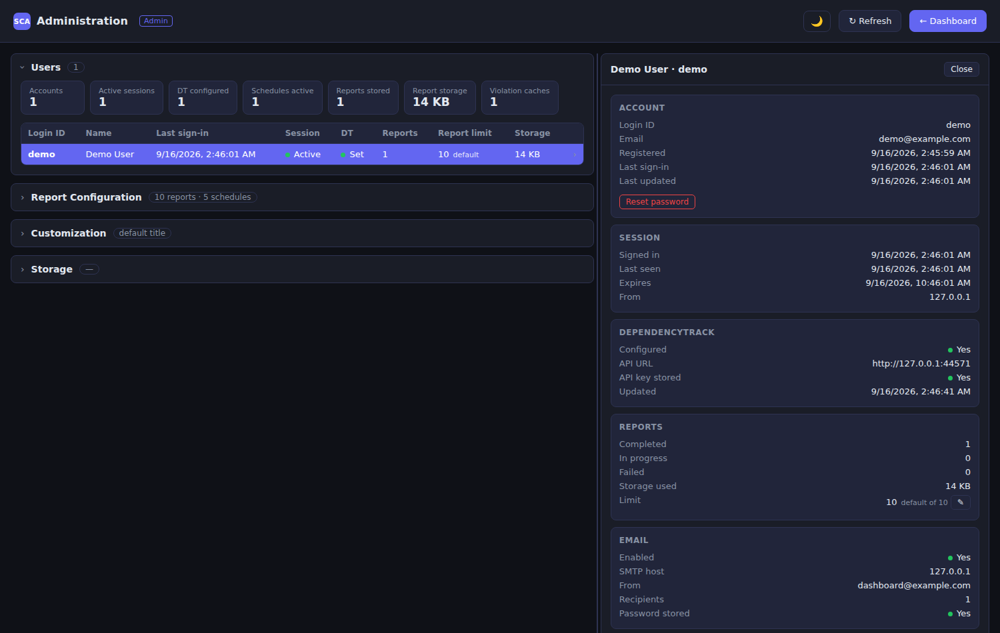

Administration is **mostly read-only**. It can do exactly six things:

| Action | Effect |
|---|---|
| Set the default report and schedule limits | Applies to every account without an override. |
| Set one account's limits | `null` returns that account to the default. |
| Reset one account's password | See below. |
| Set the application title | Blank restores the built-in name. |
| Upload a sign-in background | |
| Remove the background | Restores the animated default. |

It can read account names, quotas, storage use and sign-in history. It **cannot**
read anyone's DependencyTrack key, SMTP password, reports or findings.

> **A password reset is bounded on purpose.** The account is signed out, and the
> password you set can only ever be spent replacing itself — the user is required
> to choose a new one before reaching anything else. It never becomes a working
> credential for their DependencyTrack connection or their reports. Every reset
> is written to the audit trail.

Raising a limit never deletes anything. An account already over a lowered limit
is simply blocked from creating more.

---

## 12. Troubleshooting

**"Showing mock data" won't go away.**
No connection is saved. Open Settings, complete the Connection section and
**Save** — testing alone does not save it.

**Test Connection fails.**
- *Cannot reach the server* — check the URL and that this host can reach
  DependencyTrack. It is usually an internal address.
- *Rejected* — the API key is wrong, or lacks `VIEW_PORTFOLIO`.
- Use the **API server** URL, not the web UI's.

**The policy columns are all zero.**
The violation cache is still building. The banner says so. It is one pass over
your whole portfolio, so a large installation takes a few minutes.

**Only top-level projects appear.**
Select **↻ Refresh**. Nothing but a full refresh picks up projects added in
DependencyTrack since you loaded the page.

**"Could not resolve dependency paths."**
The graph walk did not finish. The message says which: *never started*, *stopped
making progress* (try **↻ Refetch paths**), or the error DependencyTrack
returned.

**Every finding says "no path recorded".**
Normal for a manifest-built SBOM — the generator recorded no graph to walk. The
Direct/Transitive badge is still accurate.

**"You are already signed in on another device."**
One session per account. Confirm to disconnect the other.

**A scheduled report never arrived.**
Check the schedule is **Active**, that **Send Test Email** works, and the run
history on the schedule row. History is kept for 90 days.

**Report or schedule limit reached.**
Download or clear a report; cancel a schedule; or ask your administrator to
raise the limit.

---

## See also

- [`README.md`](../README.md) — installation and what the stack contains.
- [`DASHBOARD_INTEGRATION.md`](DASHBOARD_INTEGRATION.md) — embedding the
  dashboard and how its numbers are derived.
- [`PERFORMANCE.md`](PERFORMANCE.md) — query plans and load evidence.
