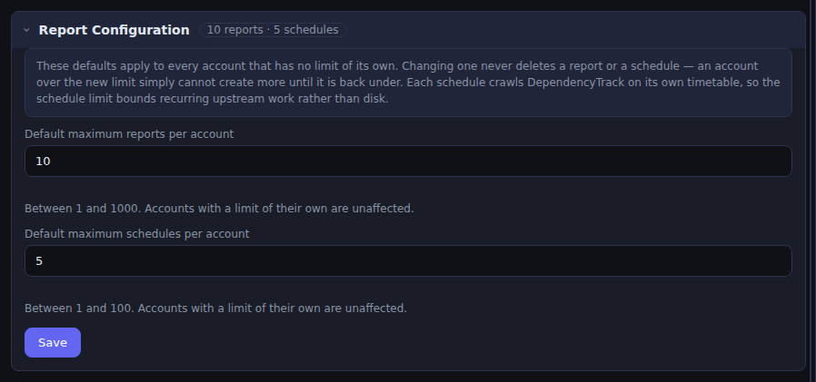
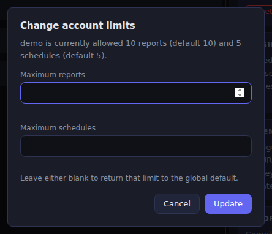
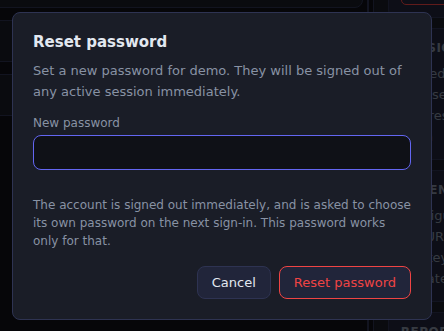
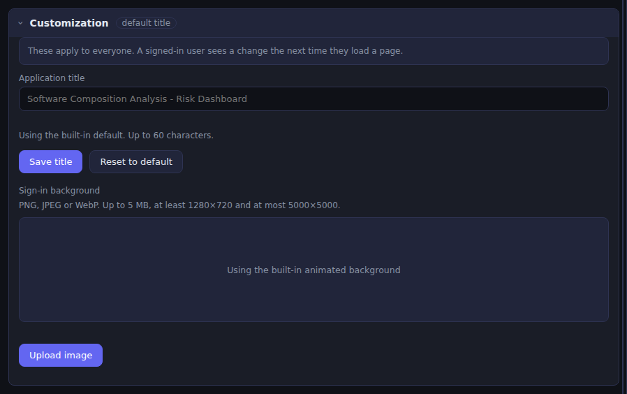

# User Guide

How to use the Software Composition Analysis Risk Dashboard, from your first
sign-in to a report landing in your inbox every Monday morning.

> **About the screenshots.** Every image here is generated by
> [`docs/screenshots.js`](screenshots.js) against a stubbed DependencyTrack — the
> same one the end-to-end tests use. The projects (`Group 1`, `service-201`), the
> findings and the dependency graph are synthetic fixtures. Nothing in these
> images comes from a real installation, which is also why the numbers on your
> own screen will differ.

**Contents**

1. [Create your account](#1-create-your-account)
2. [Your first sign-in](#2-your-first-sign-in)
3. [Connect to DependencyTrack](#3-connect-to-dependencytrack)
4. [Read the dashboard](#4-read-the-dashboard)
5. [Track risk over time](#5-track-risk-over-time)
6. [Inspect a project's findings](#6-inspect-a-projects-findings)
7. [Generate an Excel report](#7-generate-an-excel-report)
8. [Set up email](#8-set-up-email)
9. [Schedule a recurring report](#9-schedule-a-recurring-report)
10. [Manage your account](#10-manage-your-account)
11. [For administrators](#11-for-administrators)
12. [Troubleshooting](#12-troubleshooting)

---

## 1. Create your account

Open the dashboard URL your administrator gave you. You land on the sign-in
page; choose **Create an account** underneath the form.


Fill in:

| Field | Notes |
|---|---|
| First name, Last name | Shown in the header and on your profile. |
| Login ID | What you sign in with. Checked for availability as soon as you leave the field. It cannot be changed later. |
| Email address | Optional, but it is how a password reset reaches you. Also unchangeable. |
| Password | **At least 12 characters, no spaces.** There is no upper-case/digit/symbol rule — a long passphrase is both stronger and easier. |

> **You cannot register the administrator's login ID**, nor `root` or `system`.
> Those are reserved so nobody can shadow the installation's administrator.

Select **Create account**. You are returned to the sign-in form with your login
ID already filled in.


Leave **Administrator login** unticked — that box is for the single installation
administrator, whose credentials live in a file rather than in the account
database.

---

## 2. Your first sign-in

Enter your password and sign in. Because no DependencyTrack connection exists
yet, the dashboard opens in **demo mode**: everything is real software drawing
made-up data, so you can look around before connecting anything.


Three things tell you this is not your portfolio:

- the **● Mock Data** indicator in the header (it reads **● Live** once connected),
- the amber banner across the top,
- the risk-trend panel saying *"No DependencyTrack connection yet."*

Nothing you see here is stored and nothing is sent anywhere. Move on to the next
step whenever you are ready.

> **Only one session per account at a time.** If you sign in from a second
> browser you are asked whether to disconnect the first. That is deliberate, and
> it is why signing in from home after leaving a session open at work prompts you
> rather than silently failing.

---

## 3. Connect to DependencyTrack

Select **⚙ Settings** in the header. The first section is **Connection**.


| Field | What to enter |
|---|---|
| **DT API URL** | The base URL of your DependencyTrack **API server**, e.g. `https://dtrack.example.com`. Not the path to an endpoint. |
| **DT Frontend URL** | Optional. The DependencyTrack web UI, so project names in the table become links. Often the same host. |
| **API Key** | A DependencyTrack API key with at least **`VIEW_PORTFOLIO`** permission. |

Select **Test Connection** first. A successful test confirms three things at
once — the URL really is a DependencyTrack API root, the key is accepted, and
the key carries the permission the dashboard needs. On success you see the
server's version, as above.

Then select **Save**.

**Your connection is yours alone.** Each account stores its own URL and key; you
never see another user's, and they never see yours.

> **The API key is stored encrypted and is never sent back to a browser** — not
> to yours, not to anyone's. After saving, the field shows only that a key is
> configured. To change it, type a new one over the top; to keep it, leave the
> field alone.

The dashboard now fetches your portfolio and begins building the **violation
cache** — one pass over DependencyTrack's policy violations, so that every later
page load is instant. The banner reads *"⏳ Refetching violations…"* while it
runs; the policy columns stay at zero until it finishes.

> **Users who share a DependencyTrack connection share one cache build.** If a
> colleague on the same connection started a refresh, your ↻ Refresh button is
> disabled until theirs finishes — you get their result rather than making
> DependencyTrack do the same work twice.

---

## 4. Read the dashboard


**The table is your project hierarchy.** Group rows (bold, with a ▾) expand to
their children. A **group row's numbers are the total of the children it is
configured to aggregate** — in the screenshot `Collection 4` shows **3**, which
is `service-402`'s figure alone, because that project is set in DependencyTrack
to aggregate only children marked as the latest version. `service-401`'s 5 is
not counted. Where a parent aggregates all its children instead, the roll-up
climbs through however many levels the branch has.

**Which children count is DependencyTrack's setting, not ours.** If you have made
a project a *collection project* in DependencyTrack, this dashboard follows the
collection logic you chose there:

| Your setting in DependencyTrack | What the group row totals |
|---|---|
| Aggregate direct children | every child |
| Aggregate direct children **marked as latest** | only the children flagged as the latest version |
| Aggregate direct children **with tag** | only the children carrying that tag |
| Not a collection project | every child |

So a parent set to "latest only" over five versions of one service shows the
latest version's figures, not the sum of all five — the same number
DependencyTrack shows for it.

Two consequences worth knowing:

- Under **"latest only"**, a child that is itself a group has no version, so
  DependencyTrack does not mark it latest and it is not counted. A whole branch
  can legitimately read zero under such a parent.
- A parent that is **not** a collection project still shows the total of its
  children here. DependencyTrack would show only its own figures, which for an
  organisational parent with no SBOM of its own is zero — and the three policy
  columns are never aggregated by DependencyTrack at all, so that total is one
  this dashboard computes for you either way.

The risk-trend panel uses this same rule, so the graph and the cards always agree.

**The four column groups are four different questions:**

| Group | What it counts |
|---|---|
| **Security risk** | CVEs, by severity — Critical / High / Medium / Low / Unassigned. |
| **Operational risk** | Policy violations about how a component is maintained (outdated, unresolved). |
| **License risk** | Policy violations about a component's licence. |
| **Security policy** | Policy violations your DependencyTrack security policies define. |

The last three are **Fail / Warn / Info**, which is DependencyTrack's own policy
violation state — not a severity.

**The cards fold all four together.** *Critical issues* is severity-critical
**plus** every operational, licence and security-policy `FAIL`, which is why it
is a larger number than the Critical column alone. Each card is clickable and
filters the table to the projects contributing to it.

**The cards count the same projects the group rows do.** A project that no
parent's collection logic counts — `service-401` in the example above — is not
in the cards' figures, is not in their "N projects" line, and does not appear in
the table when you filter or switch to Flat View. If you need to see it, change
the collection logic in DependencyTrack, or look at the parent it sits under.

**The cards follow your filter.** Search for a team's projects, or click a card,
and the four figures become that selection's rather than the whole portfolio's.
The portfolio number stays beside them in grey — *12 **of 47*** — so you can
still see how large a slice you are looking at. Clear the filter and the grey
half disappears, because there is nothing left to compare against.

**Other controls:**

- **Search** — two characters or more, matches project names.
- **★ Latest Only** — hides older versions of the same project.
- **⊟ Flat View** — drops the hierarchy and lists every project.
- **All risk levels / All categories / All tags** — narrow the table.
- **↓ Export CSV** — the table as it currently stands.
- **↻ Refresh** — reloads the hierarchy *and* refetches violations. Use this
  after adding a project in DependencyTrack; nothing else picks up a new one.

A **⚠** beside a project name means its numbers may be incomplete — hover it for
the reason. On a group row it means a descendant's numbers are missing, so the
group's total may be understated.

---

## 5. Track risk over time


The panel above the cards is server-side history: one reading per day, captured
whenever a violation refresh completes. It is **per connection**, so everyone on
the same DependencyTrack sees the same series.

- **Period** — last 7 days, month or year.
- **Metric** — *All risk — matches the cards* is the default and is the cards'
  own arithmetic. Switch to the severity-only reading if you want pure CVE
  counts.
- **/ Lines** and **⊞ Split by severity** change the drawing.

**A day nobody refreshed carries the previous reading forward**, and the drawing
says so in four ways at once: the bridging line is **dashed**, the span is
**shaded**, a carried day gets **no dot**, and its tooltip names the day the
number actually came from. The header's *"5 of 7 days recorded"* is the only
unqualified statement of how much was really measured.

Days *before* your first reading stay empty. There is nothing to carry.

---

## 6. Inspect a project's findings

Select the **👁** icon beside any leaf project. It appears on projects that have
CVEs **or** licence-policy risk — a project clean on both has no icon, and group
rows never do, because a group has no DependencyTrack project of its own.


**Show** switches between two independent tables: *Security Violations* (CVEs)
and *License Risk* (licence policy violations).


### Origin: the question this dialog exists for

The **Origin** column answers *does this block the release, or does it go on the
backlog?*

| Badge | Meaning |
|---|---|
| **Direct** | Your project declares this component itself. You can change its version. |
| **Transitive** | Something you depend on pulled it in. You cannot bump it directly. |

This badge is always live — it is read from DependencyTrack every time you open
the dialog, so it can never lag behind what DependencyTrack currently reports.

### Dependency paths

**Show full dependency paths** is off by default because it is the expensive
half: it walks the dependency graph outward to work out *how* a transitive
component gets in. Tick it and each transitive finding gains a line beneath it:

```
carrier-for-service-201 → dep-service-201-2   1 more route from carrier-for-service-201
```

Read that as: the direct dependency `carrier-for-service-201` reaches
`dep-service-201-2`, and there is **one further route** in from that same parent
which is not shown. A component reachable from three different direct
dependencies gets three such lines, one per parent.

- A trailing **`+`** (`12+`) means the count is a floor — the walk was cut short,
  so there are *at least* that many.
- **"No path recorded"** means the walk ran and found nothing. That is ordinary:
  a flat, manifest-built SBOM genuinely records no graph.
- The result is **cached and shared** with everyone on your connection, so the
  second person to open this project pays nothing.
- **↻ Refetch paths** re-walks from scratch, for when you suspect the cache and
  DependencyTrack have diverged.

### Narrowing the table


- **Origin** — Both / Direct / Transitive.
- **Parent** — once paths are resolved, filter to the findings reached through
  one particular direct dependency. **All** means no filter; **N/A** means "this
  row *is* a direct dependency".

Both filters are local: changing them makes no network call, and *"Showing N of
M"* updates with them.

> **This dialog does not close if you click beside it** — only the **✕** closes
> it. Opening it starts a crawl against DependencyTrack, and a mis-aimed click
> should not throw that away. Reopening the same project during the same visit
> is instant; it reuses what was already fetched.

---

## 7. Generate an Excel report

Tick the projects you want (leave everything unticked to report on whatever the
table currently shows), then **📋 Report ▾ → Generate Report**.


Pick your risk categories. **Report name** is optional — leave it blank and one
is generated with a timestamp.

> A report name is **validated, not silently corrected**. Quotes, slashes and
> control characters are refused, because the name becomes a filename.

The job runs on the server; you can keep working. Open **🗃 Reports** in the
header to see it.


**Download** saves the workbook and clears it from the server. The badge on the
button shows how many are waiting.

### What is in the workbook

One group of sheets per category you ticked — `SV_` security, `LR_` licence,
`OR_` operational:

| Sheet | Contents |
|---|---|
| `SV_Project Summary` | One row per project: its finding counts. |
| `SV_Vulnerability Findings` | Every CVE, with CVSS, CWE and component — **and Origin and Dependency Path**. |
| `SV_Component Summary` | Findings grouped by component. |
| `SV_CWE Summary` | Findings grouped by weakness. |
| `LR_Project Summary` | Licence violations per project. |
| `LR_Violations` | Every licence violation — **also with Origin and Dependency Path**. |
| `LR_Unique Risks` | One row per component, folded across every project. |
| `OR_Project Summary`, `OR_Violations`, `OR_Unique Risks` | The same three for operational policy. |

The operational sheets deliberately carry **no** Origin column: an operational
violation is about how a component is maintained, not about how it entered your
build.

The **Dependency Path** column has four distinct states, and they mean different
things:

| Cell | Meaning |
|---|---|
| *(blank)* | Direct — the Origin column already said so. |
| `a → b → lib` | The chain, one line per parent. |
| `No path recorded` | Walked; the SBOM records no graph for it. |
| `Not resolved` | No walk result — nobody looked. |

On `LR_Unique Risks`, where one row covers several projects, Origin can read
**`Mixed`**: the component is a direct dependency of one project and transitive
in another. Its path cell groups by chain and names the projects each one
belongs to, so *"one project reached through three parents"* can never be
mistaken for *"three projects reached through one each"*.

> **Your report quota** is set by your administrator and shown in Settings.
> Reaching it blocks a new report; it never deletes an old one. Download or
> clear one to make room.

---

## 8. Set up email

Scheduling needs somewhere to send to, so configure email first. In **⚙
Settings**, turn on **Email & Scheduled Reports**.


| Field | Notes |
|---|---|
| **Host**, **Port**, **TLS** | Your SMTP server. |
| **Username**, **Password** | SMTP credentials. Stored encrypted; never returned to the browser. |
| **From Address** | What recipients see as the sender. |
| **To** | Default recipients, comma-separated. |
| **CC** | Optional default copy list. |
| **Subject**, **Body** | Defaults for every scheduled report. |

**Send Test Email** proves the settings work before you rely on them. Then
**Save**.

---

## 9. Schedule a recurring report

Tick your projects, then **📋 Report ▾ → Schedule Reports**.


| Field | Notes |
|---|---|
| **Name** | The label in your schedule list. Purely for you. |
| **Frequency** | Daily, Weekly (pick days) or Monthly (pick a day, capped at the 28th so every month has one). |
| **Send at** | Shown in **your** timezone; the caption underneath says what is stored in UTC. |
| **Risk categories** | Same three as a manual report. |
| **Report file name** | What the attached workbook is called. |
| **Delivery** | Leave blank to inherit the account defaults from step 8. |

**CC has three distinct states**, which is why it has its own switch:

- switch **on**, field **blank** → inherit the account's CC list,
- switch **on**, field **filled** → copy exactly these people,
- switch **off** → **copy nobody**.

A blank field alone cannot express "copy nobody", which is why the switch exists.

Select **Save schedule**, then **←** to return to the list.


Each row shows the frequency, the next run, the recipients and whether it has
ever run. The row itself gives you two things: the **switch** pauses a schedule
without discarding it, and selecting the row **opens it** for editing.

Everything else lives inside the editor, below the delivery fields:

- **Send now** — runs it immediately **without moving the timetable**. A Monday
  09:00 schedule stays Monday 09:00 however often you test it, and a paused
  schedule can still be sent by hand. It also takes its turn in the queue rather
  than starting a second crawl.
- **Runs** — the run history, kept for 90 days.
- **Cancel this schedule** — deletes it. The record that it ran survives.

> **You can have several schedules, but only one of yours runs at a time.** Five
> due at 09:00 run one after another rather than opening five simultaneous
> crawls against your single DependencyTrack connection.

### Projects included: a fixed list, or a rule

The **Projects included** dropdown decides how the projects you picked are
read. It is the answer to a problem fixed lists have: every release changes
which version DependencyTrack marks as *latest*, so a schedule built by ticking
boxes has to be deleted and rebuilt each time — and until somebody does, it
quietly keeps reporting the **previous** release.

| Setting | What each run covers |
|---|---|
| **These projects** | Exactly the projects you ticked. The original behaviour, and the default — your existing schedules are unchanged. |
| **Latest versions under these** | The projects you ticked become **anchors**. Each run descends from them and takes the current latest release beneath each one. |
| **All latest in the portfolio** | Every project marked latest, anywhere. No selection is stored at all. |

Under the dropdown, the editor tells you what the rule resolves to **right
now** — the anchors it will descend from, how many projects that is today, and
a warning for any anchor with nothing marked latest beneath it. Check that line
before saving: it is also how you find out how large *All latest* is for your
own portfolio.

Three things are worth knowing before you choose a rule.

**It follows your DependencyTrack collection settings, level by level.** If a
group is configured to aggregate "latest version children", the schedule counts
exactly the children that group's own row on the dashboard counts. That is
deliberate: the report covers precisely the projects the screen is summarising,
so the two can never contradict each other. One consequence follows from it —
under "latest version children" a child that is itself a *group* is excluded,
because it has no version of its own, so a branch of sub-groups under such a
parent is not reached. The preview will show you a smaller number than you
expected if this applies to you.

**Picking a specific version anchors to its parent.** Ticking
`service-401 v1.2` and choosing a latest rule means "the latest release here",
so the schedule anchors on that project's parent group. Because a parent also
holds its siblings, this **widens** what the schedule covers — the editor says
so explicitly when it happens.

**Groups are never reported on, only descended through.** A group row's numbers
on the dashboard are the sum of its children's, so it has no findings of its
own to report.

### When the covered set changes

A rule-driven schedule adjusts itself: a new branch appears and is picked up, a
deleted one drops out, a new release replaces the old one. Growth is harmless.
A set getting *smaller* is the one to watch, because nothing about a narrower
report looks wrong — it still arrives and still looks healthy.

So every run after the first compares itself to the one before and adds a line
to the covering email:

> Projects covered: 9 (was 12 — 3 no longer covered: payments-api 2.4,
> auth-svc 1.9, billing-worker 3.1)

Removed projects are **named**; newly covered ones are only counted, because a
new project is self-evident in the workbook it appears in while a missing one
is not. The run history records the number covered each time, so you can see
drift there too.

There is a ceiling on how many projects one run may cover (250 by default, set
by your administrator). A run over it is **refused rather than trimmed** — a
workbook silently covering the first 250 of 400 projects would not say on its
face that it was partial.

Scheduled reports are built in memory and emailed. They never appear in your
Reports list and are never written to disk.

---

## 10. Manage your account

**👤 → Profile**.


You can change your **first and last name** and your **password**. Login ID and
email address are fixed at registration.

**Delete account** removes your account, settings, schedules and every report you
have generated. You must type your login ID to confirm. The authentication audit
trail survives, as an audit trail must.

---

## 11. For administrators

Sign in with **Administrator login** ticked, using the credentials created at
installation — they live in a file on the server, not in the account database,
so no ordinary account can ever become the administrator. Then
**👤 → 🛡 Administration**.

An ordinary user who types the `/admin.html` URL is sent back to the dashboard
rather than shown a screen whose every request would be refused.

### What administration can and cannot do

**It is mostly read-only, and what it may change is a closed list of eleven
things** — not a general-purpose account editor:

| # | Action | Where |
|---|---|---|
| 1 | Set the **default** report limit | Report Configuration |
| 2 | Set the **default** schedule limit | Report Configuration |
| 3 | Override **one account's** limits | Users → account → ✎ |
| 4 | Reset **one account's** password | Users → account → Reset password |
| 5 | Set the application title | Customization |
| 6 | Upload or remove the sign-in background | Customization |
| 7 | Upload the application icon | Customization |
| 8 | Remove the icon, returning to the initials mark | Customization |
| 9 | Show or hide the risk-trend panel for everyone | Customization |
| 10 | Upload a colour theme | Customization |
| 11 | Remove the theme, returning to the built-in colours | Customization |

Everything else is readable only. Administration **cannot** read anyone's
DependencyTrack API key, SMTP password, reports, findings or schedules' contents.
It sees only that a key or password *is stored*.

### The Users section


The tiles across the top are the whole installation at a glance: accounts,
active sessions, how many have a DependencyTrack connection, active schedules,
stored reports, report storage and violation caches.

Selecting an account opens its detail on the right:

| Panel | Shows |
|---|---|
| **Account** | Login ID, email, registered / last sign-in / last updated. |
| **Session** | Whether they are signed in, from which IP, and when the session expires. |
| **DependencyTrack** | Whether a connection is configured, its **API URL**, and whether a key is stored — **never the key itself**. |
| **Reports** | Completed / in progress / failed, storage used, and the limit in force. |
| **Email** | Whether mail is enabled, the SMTP host, the From address, how many recipients — and that a password is stored, **never the password**. |

The administrator's own reserved identity is excluded from this list and from
the account count. It holds their connection and settings, but nothing
authenticates against it.

### 1–2. The default limits, and what a user sees

**Report Configuration** sets the numbers every account follows unless it has an
override of its own.



| Setting | Range | What it bounds |
|---|---|---|
| **Default maximum reports per account** | 1–1000 | How many generated reports one account may keep on the server at once (completed **and** in progress). |
| **Default maximum schedules per account** | 1–100 | How many recurring schedules one account may have. |

**How this reaches the user.** Their **⚙ Settings → Max Report Downloads**
section shows the number in force and reads *"Set by your administrator. Ask
them if you need it raised."* — they cannot change it there. On the schedule
side, the schedule list footer reads *"1 of 5 schedules used"*.

When they hit either limit they get a clear refusal, not a silent failure:

- a new report is refused with the limit named, and they are told to download or
  clear one,
- a new schedule is refused the same way.

> **Lowering a limit never deletes anything.** An account already over the new
> number simply cannot create more until it is back under. This is deliberate:
> the same change applies to every account at once, and a version of it that
> trimmed would destroy reports across the whole installation in one click.

The schedule limit is not about disk — a schedule costs almost nothing to store.
It bounds how much **recurring work** the installation sends upstream, because
each schedule crawls DependencyTrack on its own timetable.

### 3. Overriding one account

In an account's detail, the ✎ beside **Limit** opens:



The dialog states what the account is allowed now and what the defaults are.

**Leaving a field blank returns that limit to the global default** — which is a
different thing from typing the default's current value. An account set
explicitly to 10 stays at 10 when you later raise the default to 20; an account
left blank moves to 20 with everyone else. That distinction is the entire reason
the field can be emptied.

**How this reaches the user.** Immediately, on their next page load. Their
Settings panel shows the new number, and the administration list marks the
account `10 default` or `25` so you can see at a glance which accounts have been
singled out.

### 4. Resetting a password

Use this when somebody is locked out. Select the account, then **Reset
password**.



**This is the most privileged thing in the product** — you are choosing a value
that authenticates as somebody else — so three things bound it, and the dialog
says so:

1. **They are signed out immediately.** Any live session is revoked, so you
   cannot silently ride along behind them.
2. **The password you set can only ever be spent replacing itself.** On their
   next sign-in they are required to choose their own, and until they do, every
   other part of the product is closed to them. It never becomes a working
   credential for their DependencyTrack connection or their reports.
3. **Every reset is written to the audit trail**, in the same transaction as the
   change itself.

**How this reaches the user.** They are signed out wherever they were. Signing in
with the password you gave them lands them on a "choose a new password" screen
and nowhere else. Once they choose one, they continue straight into the
dashboard — they are not made to sign in twice.

> You cannot reset your **own** administrator password here. It lives in the
> credentials file on the server, and changing it means changing that file.

### 5–6. Customization



| Setting | Notes |
|---|---|
| **Application title** | Up to 60 characters. **Save title** applies it; **Reset to default** restores the built-in name. |
| **Sign-in background** | PNG, JPEG or WebP, up to 5 MB, at least 1280×720 and at most 5000×5000. **Upload image** replaces the animated default; removing it restores the animation. |

**How this reaches the user.** The panel says it plainly: *"These apply to
everyone. A signed-in user sees a change the next time they load a page."* No
sign-out is needed.

The title appears in the browser tab, the dashboard header, the sign-in page and
the footer — and the small logo mark is derived from it, up to three initials, so
a renamed installation does not keep wearing the old name's badge. The
background is public by construction: it is on the sign-in page, which anyone who
can reach the service can already see.

### 7–8. The application icon

The mark beside the application name is the title's initials — up to three
letters from its first three words. Upload an icon in **Customization** and it
replaces them everywhere the mark appears: the dashboard header, the sign-in
page and the administration screen.

| Requirement | Value |
|---|---|
| Format | PNG, JPEG or WebP |
| Size | 256 KB at most |
| Dimensions | 64×64 to 512×512 |
| Shape | Near-square — at most 1.25:1 |

**SVG is deliberately not accepted.** It is XML and can carry script, and this
image is served to anyone who can reach the sign-in page, before they have
signed in. The same rule applies to the sign-in background.

A file outside those bounds is **refused with the reason**, naming which limit
it missed, rather than being resized or cropped. Cropping would decide for you
which part of your mark to lose.

**How this reaches a user:** the new mark appears on their next page load, on
every screen. Nobody needs to sign out. **Remove** returns every screen to the
initials — the icon is a replacement for them, not a requirement, so an
installation that never uploads one keeps exactly the mark it has today.

### 9. Showing or hiding the risk trend

The **Risk trend** panel sits above the project table and charts how the
portfolio's risk has moved. Turn it off in **Customization** and it disappears
for every user.

**How this reaches a user:** the panel is simply not on their dashboard. The
rest of the screen is unchanged, and no setting of theirs is lost.

**History keeps being recorded while it is hidden.** Every violation refresh
still stores that day's snapshot, so turning the panel back on shows an
unbroken line rather than a gap for the period it was off. This matters because
a gap cannot be filled in later — the measurement it needed is gone.

### 10–11. The colour theme

**Customization → Colour theme** applies one palette to the whole installation —
the dashboard, the administration screen and the sign-in page.

**How this reaches a user:** every screen changes colour. Nothing else moves: no
setting of theirs is lost, and **each person still chooses dark or light for
themselves**. A theme defines *both* schemes; the switch in the header picks
which one that person sees.

**The file is JSON, not CSS,** and it looks like this:

```json
{
  "version": 1,
  "name": "Contoso",
  "dark":  { "accent": "#7c5cff", "surface": "#141824" },
  "light": { "accent": "#4c3fd0" }
}
```

**It may be partial, and that is the normal way to use it.** Set only the
colours you want to change; everything you leave out keeps its built-in value,
one property at a time. Supplying only `dark` is fine and common — a colour that
reads well on a dark background often does not read on white, so there is no
obligation to invent a light one.

Use **Download template** to start from a file containing every colour at its
built-in value, then delete the lines you do not want to change. The property
names are the same in both schemes:

| Group | Properties |
|---|---|
| Surfaces and text | `bg`, `surface`, `surface2`, `border`, `text`, `text-muted` |
| Accent | `accent`, `accent-hover`, `on-accent` |
| Severity | `critical`, `high`, `medium`, `low`, `ok`, and each one's `-bg` tint |
| Table and code | `cat-operations`, `cat-secpolicy`, `code`, `scrollbar`, `scrollbar-hover` |
| Sign-in page | `login-blob-1`…`4`, `login-blob-admin-1`…`4`, `logo-gradient-end` |

Values are `#rgb`, `#rrggbb` or `rgba(r,g,b,a)`. Colour names like `red`,
gradients and `var(...)` are not accepted.

**Layout is deliberately not themeable.** Row heights, the header height and
corner radii are read by the table's measured geometry, so changing them would
break the layout rather than restyle it.

**A file with a mistake in it is refused whole, and every problem is named:**

```
✗ Theme not applied
    dark.acccent is not a theme property
    light.surface: "#12345" is not a colour
```

Nothing is applied and nothing is changed. That is deliberate — applying the
half that parsed would leave you with a theme that "didn't work" and no way to
tell which line was ignored.

**Download current** saves whatever is stored now, so a theme can be copied to
another installation. **Restore built-in** removes it and every screen goes back
to the colours the product ships with; the file itself is not kept, so keep your
own copy or download it first.

> **Why JSON rather than a stylesheet.** The theme is served to anyone who can
> reach the sign-in page, before they have signed in. A stylesheet can load
> external resources and cover the page; a fixed list of colour properties
> cannot. The service renders the CSS itself from the names and values it
> recognises.

### Storage

The **Storage** section reports filesystem headroom and database size for the
whole installation. It is read-only, and it is where you look before raising the
default report limit for everybody.

---

## 12. Troubleshooting

**"Showing mock data" won't go away.**
No connection is saved. Open Settings, complete the Connection section and
**Save** — testing alone does not save it.

**Test Connection fails.**
- *Cannot reach the server* — check the URL and that this host can reach
  DependencyTrack. It is usually an internal address.
- *Rejected* — the API key is wrong, or lacks `VIEW_PORTFOLIO`.
- Use the **API server** URL, not the web UI's.

**The policy columns are all zero.**
The violation cache is still building. The banner says so. It is one pass over
your whole portfolio, so a large installation takes a few minutes.

**Only top-level projects appear.**
Select **↻ Refresh**. Nothing but a full refresh picks up projects added in
DependencyTrack since you loaded the page.

**"Could not resolve dependency paths."**
The graph walk did not finish. The message says which: *never started*, *stopped
making progress* (try **↻ Refetch paths**), or the error DependencyTrack
returned.

**Every finding says "no path recorded".**
Normal for a manifest-built SBOM — the generator recorded no graph to walk. The
Direct/Transitive badge is still accurate.

**"You are already signed in on another device."**
One session per account. Confirm to disconnect the other.

**A scheduled report never arrived.**
Check the schedule is **Active**, that **Send Test Email** works, and the run
history on the schedule row. History is kept for 90 days.

**Report or schedule limit reached.**
Download or clear a report; cancel a schedule; or ask your administrator to
raise the limit. Your current limit is shown in **⚙ Settings**; only an
administrator can change it.

**You are asked to choose a new password as soon as you sign in.**
An administrator has reset it. Until you choose your own, nothing else in the
product is reachable — that is deliberate, so the password they typed can never
become a working credential for your connection or your reports.

**The dashboard has a different name or background than yesterday.**
An administrator changed it under Customization. It applies to everyone and
takes effect on your next page load.

**(Administrator) "Administrator login is disabled."**
The credentials file was never created — usually a stack started without running
`install.sh`. It is never created silently at runtime; re-run the installer.

**(Administrator) An account is missing from the Users list.**
The administrator's own reserved identity is excluded by design, from both the
list and the account count. Nothing authenticates against it.

---

## See also

- [`README.md`](../README.md) — installation and what the stack contains.
- [`DASHBOARD_INTEGRATION.md`](DASHBOARD_INTEGRATION.md) — embedding the
  dashboard and how its numbers are derived.
- [`PERFORMANCE.md`](PERFORMANCE.md) — query plans and load evidence.
